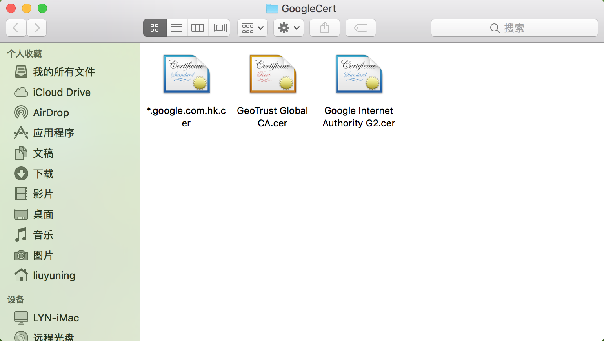

# VerifyCA
证书验证原理 Verify Certificate

#### 1、证书结构(包含3部分内容)
1. 证书信息，包括名称、签发者、日期、加密算法之类
2. 公钥，用来对数据进行加密
3. 签名，是上级证书签发机构对“证书信息”和“公钥”哈希之后再用私钥加密的内容，用来验证1和2的正确性

证书的信息可以使用命令查看：
```shell
openssl x509 -in 'Google Internet Authority G2.cer' -inform DER -text -noout
```
用谷歌的二级证书作为例子，证书文件Google Internet Authority G2.cer，从图中可以看出证书文件的结构：


#### 2、证书验证过程
所需数据：原文、签名值、公钥（原文和签名值都在同一个证书里，如图；公钥是指签发者Issuer的公钥，即上一级证书里的公钥，如果是根证书那就是自己的公钥）

1. 将原文[Cert info]做哈希计算，得Hash1
2. 将签名值[Signature data]用上级公钥解密，得Hash2
3. 将Hash1和Hash2对比是否一致

验证代码例子见VerifyCA工程，里面有直接使用OpenSSL函数X509_verify验证的例子，还有一个手动验证的例子。
```objc
//X509_verify() -> ASN1_item_verify() -> EVP_DigestVerifyFinal() -> EVP_DigestFinal_ex(), EVP_PKEY_verify() -> pkey_rsa_verify() -> RSA_verify() -> int_rsa_verify() -> RSA_public_decrypt, d2i_X509_SIG()
//int X509_verify(X509 *a, EVP_PKEY *r);
int verify = X509_verify(certG2, pub_key);
```

证书预览和文件数据如图


#### 3. 如何从浏览器获取证书





