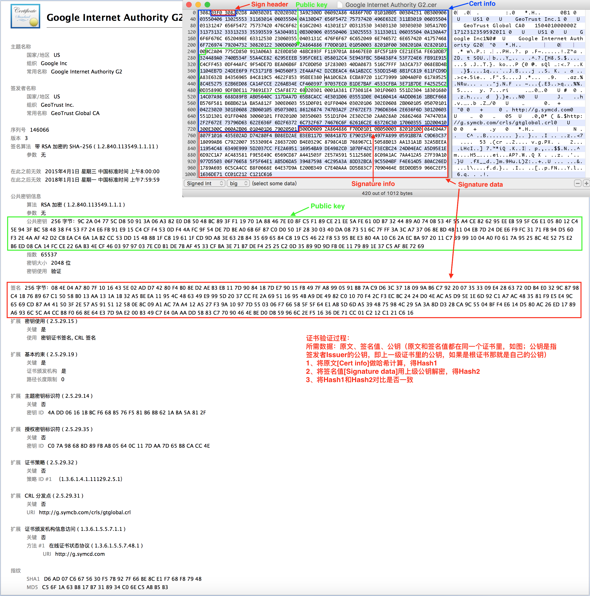
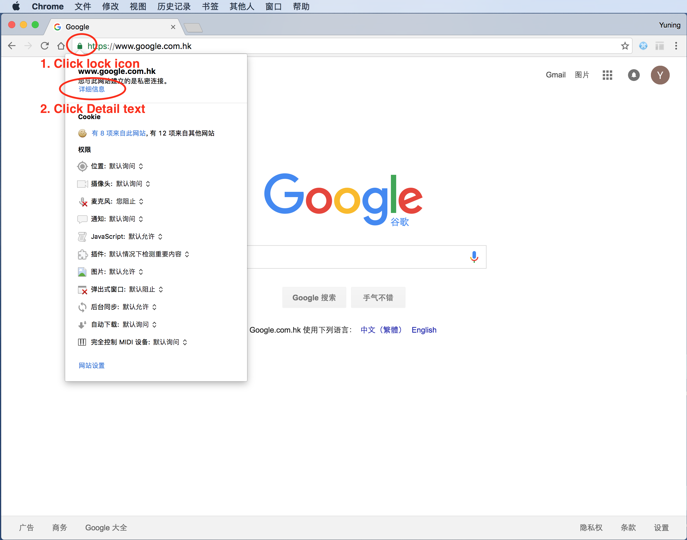
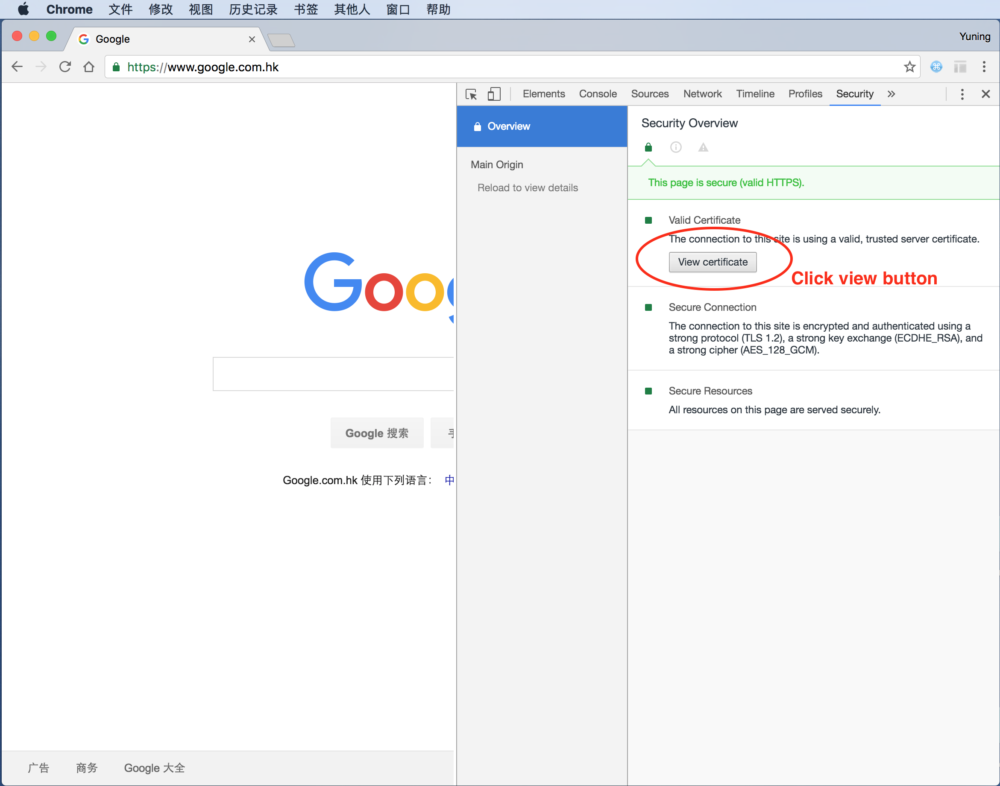
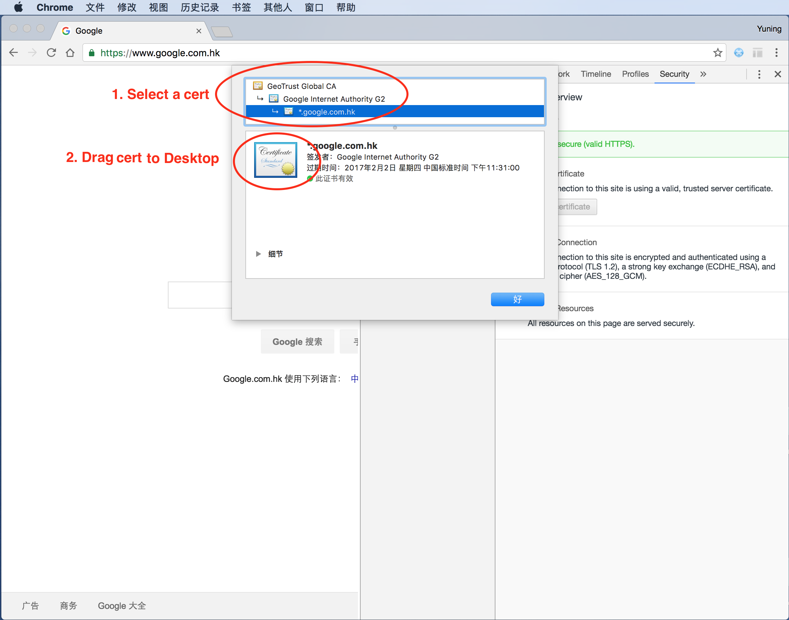

# VerifyCA
证书验证原理 Verify Certificate

#### 1、证书结构

证书包含3部分内容：

1、证书信息，包括名称、签发者、日期、加密算法之类

2、公钥，用来对数据进行加密

3、签名，是上级证书签发机构对“证书信息”和“公钥”哈希之后再用私钥加密的内容，用来验证1和2的正确性

证书的相关信息可以使用命令查看：
```shell
openssl x509 -in 'Google Internet Authority G2.cer' -inform DER -text -noout
```
用谷歌的二级证书作为例子，证书文件Google Internet Authority G2.cer

从图中可以看出证书文件的结构：


#### 2、证书验证
证书验证过程：

所需数据：原文、签名值、公钥（原文和签名值都在同一个证书里，如图；公钥是指签发者Issuer的公钥，即上一级证书里的公钥，如果是根证书那就是自己的公钥）

1、将原文[Cert info]做哈希计算，得Hash1

2、将签名值[Signature data]用上级公钥解密，得Hash2

3、将Hash1和Hash2对比是否一致


```objc
//X509_verify() -> ASN1_item_verify() -> EVP_DigestVerifyFinal() -> EVP_DigestFinal_ex(), EVP_PKEY_verify() -> pkey_rsa_verify() -> RSA_verify() -> int_rsa_verify() -> RSA_public_decrypt, d2i_X509_SIG()
int verify = X509_verify(certG2, pub_key);


- (void)testManualVerify{
    
    NSString *rootPath = [[NSBundle mainBundle] pathForResource:@"GeoTrust Global CA.cer" ofType:nil];
    NSString *g2Path = [[NSBundle mainBundle] pathForResource:@"Google Internet Authority G2.cer" ofType:nil];
    
    NSData *rootCertData = [NSData dataWithContentsOfFile:rootPath];
    NSData *g2CertData = [NSData dataWithContentsOfFile:g2Path];
    
    NSData *certInfo = [self certInfoOfCertificate:g2CertData];
    NSData *certSign = [self certSignOfCertificate:g2CertData];
    
    NSString *certInfoPath = [NSHomeDirectory() stringByAppendingString:@"/Documents/GoogleG2_CertInfo.dat"];
    NSString *certSignPath = [NSHomeDirectory() stringByAppendingString:@"/Documents/GoogleG2_SignData.dat"];
    
    [certInfo writeToFile:certInfoPath atomically:YES];
    [certSign writeToFile:certSignPath atomically:YES];
    
#if USE_CC_SHA
    unsigned char shaOut[CC_SHA256_DIGEST_LENGTH] = {0};
    CC_SHA256(certInfo.bytes, (CC_LONG)certInfo.length, (unsigned char *)&shaOut);
    NSData *certInfoHash = [NSData dataWithBytes:shaOut length:CC_SHA256_DIGEST_LENGTH];
    NSLog(@"[HASH]:%@",certInfoHash);//[HASH]:<0e0532dc a6d8bce0 5cc9286d e0789a86 5bba034d 98cd66cf 0cc30854 67eb5cb0>
#else
    unsigned char shaOut[SHA256_DIGEST_LENGTH] = {0};
    SHA256(certInfo.bytes, certInfo.length, shaOut);
    NSData *certInfoHash = [NSData dataWithBytes:shaOut length:SHA256_DIGEST_LENGTH];
    NSLog(@"[HASH]:%@",certInfoHash);//[HASH]:<0e0532dc a6d8bce0 5cc9286d e0789a86 5bba034d 98cd66cf 0cc30854 67eb5cb0>
#endif
    
    const unsigned char *ppRoot = rootCertData.bytes;
    X509 *certRoot = d2i_X509(NULL, &ppRoot, rootCertData.length);
    if (certRoot) {
        EVP_PKEY *pub_key = X509_get_pubkey(certRoot);
        if(pub_key){
            NSData *signatureData = certSign;
            NSData *decryptData = [self OpenSSL_RSA_DecryptData:signatureData withPublicKey:pub_key->pkey.rsa];
            NSLog(@"[DEC]:%@",decryptData);//[DEC]:<3031300d 06096086 48016503 04020105 0004200e 0532dca6 d8bce05c c9286de0 789a865b ba034d98 cd66cf0c c3085467 eb5cb0>
            
            const unsigned char *p = decryptData.bytes;
            X509_SIG *sig = d2i_X509_SIG(NULL, &p, (long)decryptData.length);
            if (sig) {
                NSLog(@"[DGST]:%@",[NSData dataWithBytes:sig->digest->data length:sig->digest->length]);
                
                if (0 == memcmp(shaOut, sig->digest->data, sig->digest->length)) {
                    NSLog(@"Manual verify signature is valid");
                }
                X509_SIG_free(sig);
            }
            EVP_PKEY_free(pub_key);
        }
        X509_free(certRoot);
    }
}


```


如图谷歌的二级证书，证书文件Google Internet Authority G2.cer




#### 3. 如何从浏览器获取证书







