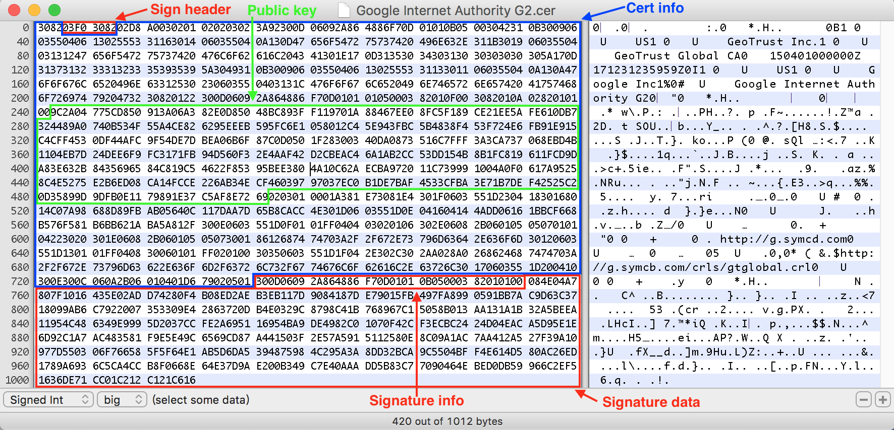
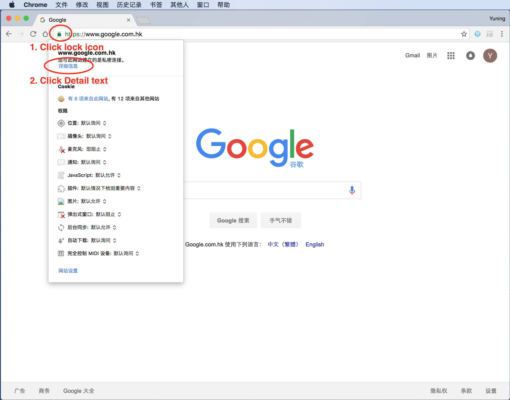

# VerifyCA
证书验证原理 Verify Certificate

#### 1、证书结构

用谷歌的二级证书作为例子，证书文件Google Internet Authority G2.cer
从图中可以看出证书的结构：

#### 2、证书验证

使用根证书来验证这个二级证书Google Internet Authority G2.cer

#### 3. 如何从浏览器获取证书

